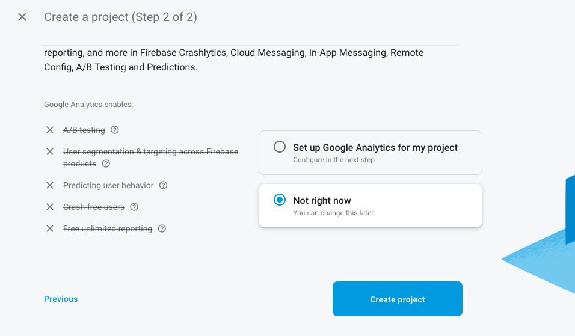

Di firebase terdapat fitur Firebase Hosting sebagai penyedia tempat untuk kita mendeploy web app, dengan konten yang statis maupun dinamis, juga microservice.

Disini saya akan mencontohkan dengan aplikasi react yang baru saya inisialisasi dengan `create-react-app`. Sebelumnya install dahulu firebase cli `npm i -g firebase-tools` untuk mengatur project firebase.

Pada saat `firebase-tools` sudah terinstall, lakukan login ke firebase-cli tersebut dengan perintah `firebase login` masukkan credential email dan password yang digunakan untuk masuk ke `console.firebase.google.com`, setelah berhasil maka akan muncul informasi sudah login ke dalam firebase-cli.

Setelah login melalui firebase-cli, kemudian buat project di firebase console `https://console.firebase.google.com/`

Jika project di firebase sudah dibuat saatnya menghubungkan project react ke firebase dengan bantuan firebase-cli.

Masuk ke root directory project react di terminal kemudian ketikkan `firebase init` maka akan muncul beberapa langkah untuk setup project.

Pertama akan muncul pilihan fitur dari firebase apa yang akan digunakan untuk project ini, karena sekarang akan menggunakan firebase hosting maka arahkan ke `Hosting` lalu pilih dengan spasi, kemudian enter.

Setup kedua adalah project firebase di console mana yang akan kita gunakan, pilih nama project yang tadi dibuat.

Kemudian akan muncul setup untuk folder mana yang akan di deploy ke firebase hosting, masukkan `build` karena folder hasil build project react bernama build dan itu nanti yang akan langsung dideploy.

Selanjutnya adalah setup untuk konfigurasi SPA, ketikkan `y` lalu enter. Maka setup konfigurasi sudah selesai. Kita bisa melihat pengaturan tersebut di file `.firebaserc` dan `firebase.json`

Sebelum kita akan coba mendeploy project ini ke firebase hosting saya ganti isi dari web agar tidak menggunakan template default bawaan `create-react-app`

Agar tidak mengetikkan perintah dua kali pada saat akan mendeploy, tambahkan script di `package.json` di bagian `scripts` dengan `"deploy": "yarn build && firebase deploy",`

Untuk mendeploy project ke firebase hosting, ketikkan perintah `yarn deploy` dan voilaa!

