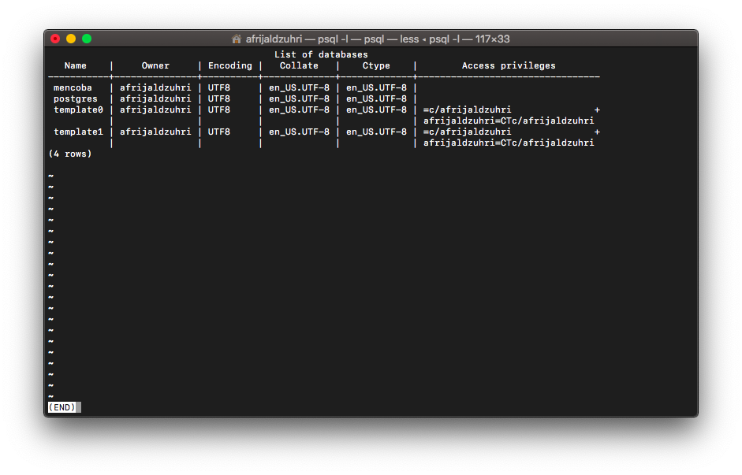
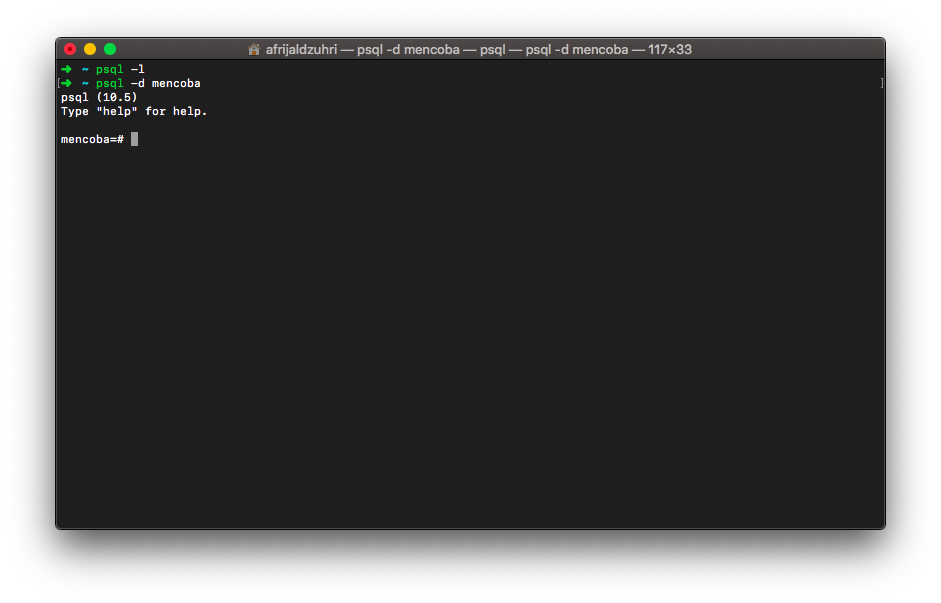
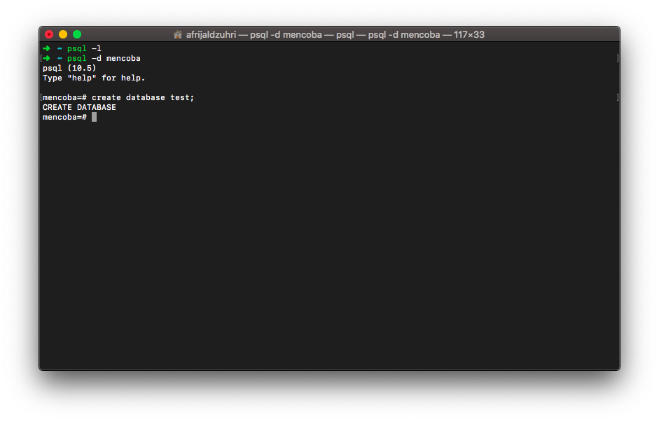

PostgreSQL adalah salah satu object-relational database system yang sangat powerful dan juga familiar.

Untuk menginstal postgreSQL di macOS kita bisa menggunakan homebrew.

`brew install postgresql`

Setelah terinstal jalankan service agar bisa menggunakan koneksi database.

`brew services start postgresql`

Service sudah berjalan, untuk melihat daftar database yang sudah ada. bisa menggunakan perintah

`psql -l`

Maka database yang sudah ada dan otomatis terbuat akan ditampilkan. Untuk keluar silahkan ketikkan `:q`.

Misal kita ingin menggunakan database postgresqlnya, gunakan perintah

`psql -d nama_database`

Sebagai contoh, disini saya menggunakan database mencoba.

Untuk membuat database postgresql baru, bisa menggunakan perintah

`CREATE DATABASE nama_database;`

Sekian dari saya, semoga bermanfaat !