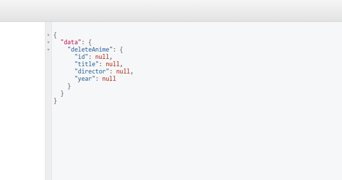

Akhir - akhir ini sangat ramai dibicarakan teknologi graphql ini, yang dalam kasusnya digunakan seperti penggunaan dalam pembuatan Rest API. Dan karena saya kurang mencari informasi, dan hanya penasaran saja tentang bagaimana graphql ini bekerja, maka saya sempatkan untuk belajar dan membagikannya kepada teman-teman yang mungkin nantinya akan menggunakan.

Mungkin langsung saja tanpa banyak kata, untuk menjalankan graphql disini saya menggunakan nodejs sebagai server-side dengan express untuk membuat servernya.
Pertama kita buat folder dan membuat _package.json_

```
mkdir belajar-graphql && cd belajar-graphql && npm init -y
```

Perintah diatas yaitu digunakan untuk membuat folder bernama `belajar-graphql` dan menginisialisasi `package.json` untuk menginstal dependensi dari node. Pastikan sudah [menginstal node dan npm](https://afrijaldzuhri.com/menginstall-nvm-sebagai-version-manager/).

Lalu install semua dependensi yang kita butuhkan.

```
npm install axios express express-graphql graphql json-server nodemon --save
```

Penjelasan dari dependensi tersebut:
Axios digunakan untuk request ke server penyedia json yang nanti akan kita gunakan.
Express nantinya kita gunakan untuk menjalankan server di localhost kita
Express-graphql digunakan sebagai tempat untuk memasukkan query kita di dalam web dengan tampilan GUI.
Graphql digunakan untuk membuat model schema.
Json-server digunakan untuk menyediakan json sebagai dummy data kita, karena kita belum menggunakan database asli sebagai datanya.
Nodemon digunakan untuk monitoring server atau sebagai watcher sehingga dalam setiap perubahan yang terjadi di file kita server akan restart dengan sendirinya.
Dan flag `--save` digunakan agar dependensi yang kita install tersimpan di dalam `package.json` .

Setelah semuanya terinstal, kita buat file `server.js` lalu masukkan

```js
// server.js

const express = require('express')
const expressGraphQL = require('express-graphql')
```

setelah itu kita buat server untuk graphqlnya,

```js
// server.js
const express = require('express')
const expressGraphQL = require('express-graphql')

const app = express()

app.listen(4000, () => {
  console.log('Server is running on port 4000...')
})
```

setelah server kita buat, kita perlu membuat Schema untuk graphqlnya. buat file baru bernama `schema.js`

```js
// schema.js

const axios = require('axios')
const {
  GraphQLObjectType,
  GraphQLString,
  GraphQLInt,
  GraphQLSchema,
  GraphQLList,
  GraphQLNonNull
} = require('graphql')
const server = 'http://localhost:3000'
```

Deklarasikan semua yang kita perlukan seperti diatas.

Lalu kita bikin tipe / model data dari object yang akan kita gunakan.

```js
// schema.js

// ..........

const AnimeType = new GraphQLObjectType({
  name: 'Anime',
  fields: () => ({
    id: { type: GraphQLInt },
    title: { type: GraphQLString },
    director: { type: GraphQLString },
    year: { type: GraphQLInt },
  }),
})
```

Kita membuat model data Anime yang fieldsnya berisi :
`id` bertipe data `Integer`,
`title` bertipe data `String`,
`author` bertipe data `String`,
`year` bertipe data `Integer`.

Setelah itu kita membuat RootQuery untuk melihat data kita secara keseluruhan

```js
// schema.js

// ...........................

const RootQuery = new GraphQLObjectType({
  name: 'RootQueryType',
  fields: {
    animes: {
      type: new GraphQLList(AnimeType),
      resolve(_parentValue_, _args_) {
        return axios.get(`${server}/animes/`)
          .then(res => res.data)
      }
    }
  }
})
```

Di RootQuery ini kita sudah menggunakan axios yang menggunakan method get untuk mengambil data dari server yang nanti akan kita buat.

Setelah itu kita buat untuk perintah CRUD.

```js
// schema.js

// ....................................

const mutation = new GraphQLObjectType({
  name: 'Mutation',
  fields: {
    addAnime: {
      type: AnimeType,
      args: {
        title: { type: new GraphQLNonNull(GraphQLString) },
        director: { type: new GraphQLNonNull(GraphQLString) },
        year: { type: new GraphQLNonNull(GraphQLInt) },
      },
      resolve(parentValue, args) {
        return axios.post(`${server}/animes`, {
          title: args.title,
          anime: args.anime,
          year: args.year,
        }).then(res => res.data)
      },
    },
    findAnime: {
      type: AnimeType,
      args: {
        id: { type: GraphQLInt },
      },
      resolve(parentValue, args) {
        return axios.get(`${server}/animes/${args.id}`)
          .then(res => res.data)
      }
    },
    updateAnime: {
      type: AnimeType,
      args: {
        id: { type: new GraphQLNonNull(GraphQLInt) },
        title: { type: GraphQLString },
        director: { type: GraphQLString },
        year: { type: GraphQLInt },
      },
      resolve(parentValue, args) {
        return axios.put(`${server}/animes/${args.id}`, args)
          .then(res => res.data)
      },
    },
    deleteAnime: {
      type: AnimeType,
      args: {
        id: { type: new GraphQLNonNull(GraphQLInt) },
      },
      resolve(parentValue, args) {
        return axios.delete(`${server}/animes/${args.id}`, args )
         .then(res => res.data)
      },
    },
  }
})
```

Setelah perintah untuk melakukan mutasi kita buat lalu kita export module `schema.js` agar dapat digunakan di file lain.

```js
// schema.js
// ....................................

module.exports = new GraphQLSchema({
  query: RootQuery,
  mutation,
})
```

Setelah itu kita kembali ke file `server.js` untuk menambahkan perintah agar kita bisa menjalankan expressGraphQL dengan tampilan GUI menggunakan model dari file `schema.js`

```js
// server.js
// ..............


const schema = require('./schema.js')

const app = express()

app.use('/graphql', expressGraphQL({
  schema,
  graphiql: true,
}))

// ............
```

Setelah file `server.js` dan `schema.js` kita selesai, maka kita buat file `anime.json` sebagai data.

```json
{
  "animes": [
    {
      "id": 1,
      "title": "Spirited Away",
      "director": "Hayao Miyazaki",
      "year": 2001
    },
    {
      "id": 2,
      "title": "Byousoku 5 Centimeter",
      "director": "Makoto Shinkai",
      "year": 2007
    },
    {
      "id": 3,
      "title": "Kotonoha no Niwa",
      "director": "Makoto Shinkai",
      "year": 2013
    },
    {
      "id": 4,
      "title": "Kimi no Nawa",
      "director": "Makoto Shinkai",
      "year": 2016
    }
  ]
}
```

setelah semua file selesai kita buat, sebelum menjalankan server kita perlu mengubah `script` dalam `package.json` supaya kita bisa menjalankan json server dan server untuk graphql.

```js
// package.json

{

// ...............

  "scripts": {
    "dev": "nodemon server.js",
    "json": "json-server --watch anime.json"
  },

// ...............
}
```

setelah itu buka 2 terminal dan masuk ke folder `belajar-graphql` lalu salah satu jalankan `npm run dev` dan yang satunya jalankan `npm run json`

Buka browser lalu arahkan ke [http://localhost:4000/graphql](http://localhost:4000/graphql) maka kita akan ditampilkan dengan GraphiQL dimana itu adalah tempat untuk memaskukkan query kita.


Untuk mencobanya kita masukkan query


Maka kita akan mendapatkan response berupa


Untuk _create_, _read_, _update_, _dan delete_, silakan masukkan query berikut

#### Create


Maka akan mendapat response


#### Read


Maka akan mendapat response


#### Update


dengan response


#### Delete


Maka responsenya semua akan null



Sekian sedikit sharing saya kali ini, semoga bermanfaat bagi teman-teman. Sekiranya ada yang salah atau ada yang perlu diperbaiki silakan berkomentar :)

Untuk melihat source codenya [https://github.com/afrijaldz/belajar-graphql](https://github.com/afrijaldz/belajar-graphql)

Terima kasih :)