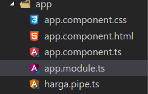
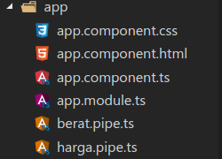
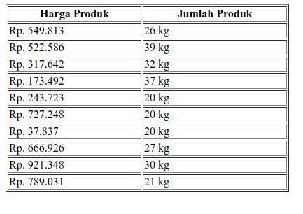

Alhamdulillah akhirnya ada waktu buat nulis lagi, dan berbagi pengalaman serta ilmu kepada teman-teman sekalian agar ilmu yang saya punya mengalir dan dapat berkembang serta bermanfaat untuk teman-teman yang baru belajar.

Pipe adalah fitur dari Angular yang digunakan untuk mentransform / menyisipi suatu data sebelum di tampilkan. Penggunaan pipe sendiri cukup mudah, yaitu dengan menambahkan simbol pipe ( | ) setelah nama properti dan diikuti dengan nama pipenya. Contoh `{{ tanggal | date }}`

Secara default, Angular sudah menyediakan pipe bawaan yang berupa `DatePipe`, `UpperCasePipe`, `LowerCasePipe`, `CurrencyPipe`, dan `PercentPipe`.

Sekarang saya ingin berbagi tentang bagaimana membuat pipe secara sederhana agar teman-teman paham bagaimana pipe ini bekerja. Kita mulai dengan membuat pipe untuk menampilkan daftar harga dan satuan berat. Kita akan menggunakan object berikut ini, untuk di taruh di `component.ts`

Lalu untuk bagian depannya, kita membuat tabel agar tampilannya terlihat rapi meski sangat sederhana.

Untuk list harga dan berat kita menggunakan `ngFor` directive untuk menampilkan nilai dari masing-masing object, karena `products` kita berbentuk array.

Kemudian kita mulai membuat pipenya, buat file bernama `harga.pipe.ts`yang akan kita gunakan untuk menampung pipe harga.

Kemudian di pipe harga tersebut kita isi.

Di dalam pipe harga tersebut terdapat decorator yang bernama Pipe yang isinya name, yaitu untuk memberi nama pipe kita dan juga nama untuk memanggil pipe kita nantinya. Method transform digunakan untuk menangkap nilai yang kita ambil dari element yang kita masukkan pipe. Kemudian kita kembalikkan lagi dalam bentuk yang sudah kita ubah. Di atas kita merubahnya dengan menambahkan simbil mata uang rupiah di depan `value` dan menggunakan regular expression untuk mengonvert nilai menjadi notasi ribuan dengan menambahkan titik pada setiap tiga kali nilai. Kita juga bisa merubah penempatan notasi dan juga titik dengan simbol, sesuai dengan keinginan kita.

Kemudian kita buat pipe satu lagi untuk berat.

Isi pipe berat tersebut akan seperti ini.

Dimana kembalian dari pipe ini cukup simple, yaitu menambahkan satuan `kg` di setelah nilai.

Setelah kita membuat pipe lalu deklarasikan dan export pipe yang kita buat di module, agar bisa digunakan dan dipanggil.

Barulah pipe kita bisa digunakan, cara penggunaannya pun cukup mudah cukup menambahkan` | <namapipe>` setelah kita memanggil properti.

Dan akhirnya kita sudah berhasil membuat pipe sederhana, maka hasilnya akan seperti ini.

Sekian dari saya, semoga bermanfaat untuk teman-teman semua yang baru belajar pipe. Jika ada masukkan atau ingin bertanya silahkan hubungi saya.

Terima kasih.