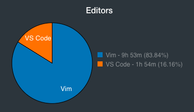

VIM adalah program yang digunakan untuk mengedit teks (text editor) yang secara fungsi sama halnya seperti Atom, VSCode, dan Sublime. VIM sendiri biasanya digunakan didalam terminal/bash, namun terdapat juga versi GUInya.

Alasan saya belajar dan ingin menggunakan VIM sebenarnya hanya karena merasa penasaran dengan text editor ini. Kebanyakan orang bilang bahwa VIM itu sulit, dan belajarnya harus ekstra sabar juga pantang menyerah.

Awalnya saya mengikuti tutorial <a href="https://www.youtube.com/watch?v=5givLEMcINQ&list=PL13bz4SHGmRxlZVmWQ9DvXo1fEg4UdGkr">ini</a> di youtube sesuai dengan <a href="https://agung-setiawan.com/dalam-proses-belajar-vim/">arahan Mas Agung Setiawan</a> setelah selesai saya eksplorasi sendiri dengan sering-sering mencoba lalu mencari tahu caranya ketika lagi dihadapkan dengan masalah.

Setelah menggunakan text editor vscode sudah kurang lebih 2 tahun, sebenarnya saya sempat beberapa kali mencoba untuk belajar VIM, namun berhenti di tengah jalan dan ketika akan mencobanya lagi sudah lupa. Namun untungnya kemarin selama hampir seminggu tidak ada pekerjaan yang terlalu padat maka saya gunakan untuk belajar VIM. 

Akhirnya setelah sering mencoba tingkat kepedean saya menggunakan text editor VIM ini sudah meningkat, saya sudah bisa ngoding menggunakan VIM meskipun belum selihai seperti saat menggunakan VSCode.

Hal yang perlu dipelajari pertama kali untuk bisa menggunakan VIM adalah mode-mode yang ada di VIM, dimana di VIM terdapat empat mode yaitu Mode Normal, Mode Insert, Mode Command, dan Mode Visual. Dengan mengenal mode-mode yang ada di VIM, kita mengetahui kapan kita bisa melakukan penyuntingan teks, melakukan navigasi, dan memberi suatu perintah. Karena di VIM kita sangat dianjurkan untuk tidak menggunakan mouse dan arrow key, maka mempelajari navigasi perlu mendapatkan perhatian lebih.

Selain pentingnya belajar navigasi di vim, ada beberapa fitur keren di VIM misalnya macro, yang dengan itu kita bisa melakukan automasi pekerjaan yang repetitif. Seperti text editor lainnya, meskipun berbasis di terminal VIM pun memiliki fitur search, replace, folding, buffer, split window, tab dan lainnya, hanya saja caranya berbeda untuk menggunakan fitur tersebut.

Hebatnya lagi, VIM ini sangat customable, kita bisa mengatur sendiri bagaimana keinginan dalam menggunakannya. Kita bisa mengubah tombol yang digunakan di VIM untuk melakukan suatu perintah hanya dengan menambahkan pengaturan di `.vimrc`. Contohnya `nmap <Leader>c :e $MYVIMRC<cr>` untuk membuka `.vimrc` dengan menekan tombol `\c` untuk membuka `.vimrc` tanpa harus menutup VIM yang sudah berjalan. Di VIM kita juga bisa menginstall plugin-plugin yang bisa membantu kita bekerja.

Karena sekarang sudah lumayan bisa, jadi sudah mulai menggunakan vim sebagai text editor utama.

