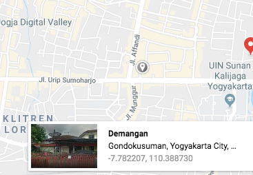
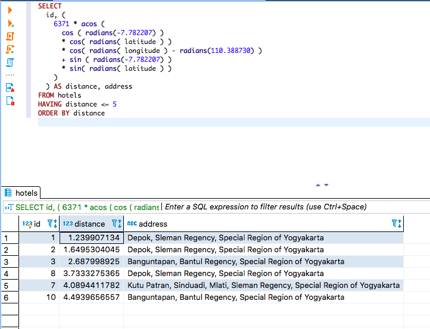

Di kasus yang saya buat ini, kita mempunyai beberapa data hotel di masing-masing daerah, dan kita sedang berada di Yogyakarta ingin mengambil data yang hanya ada di sekitar kita dengan radius katakanlah 10 km.

Buat database baru

`CREATE DATABASE coba_maps;`

Di dalam table tersebut, saya akan isi table `hotels` dengan atribut `id`, `name`, `address`, `latitude`, `longitude`. Atribut `id` dijadikan `primary key`, dan atribut `latitude`, `longitude` menggunakan tipe `float` dengan ukuran `(10, 6)`.

```sql
CREATE TABLE `coba_maps`.hotels (
    id INT NOT NULL AUTO_INCREMENT,
    name varchar(100) NOT NULL,
    address varchar(100) NOT NULL,
    latitude float(10,6) NOT NULL,
    longitude float(10,6) NOT NULL,
    PRIMARY KEY (id)
)
ENGINE=InnoDB
DEFAULT CHARSET=utf8
COLLATE=utf8_general_ci;
```

Kemudian masukkan beberapa data hotel dengan lokasi yang berbeda-beda, disini saya mengambil latitude dan longitude dengan bantuan google maps, caranya

* klik tempat yang kita inginkan di maps
* akan muncul kotak dialog informasi mengenai daerah yang kita klik, disana juga tertera latitude dan longitudenya.




Disini saya akan membuat data-data hotel yang memiliki `latitude` dan `longitude` berdasarkan lokasinya, dan data yang saya buat saya kasih beberapa data yang tidak berada di Yogyakarta.

```sql
INSERT INTO `hotels` (`name`, `address`, `latitude`, `longitude`) VALUES 
('Hotel Santika', 'Depok, Sleman Regency, Special Region of Yogyakarta', '-7.775286','110.379903'),
('Hotel Maradona', 'Depok, Sleman Regency, Special Region of Yogyakarta', '-7.782064','110.403704'),
('Hotel Tukijan', 'Banguntapan, Bantul Regency, Special Region of Yogyakarta', '-7.790874', '110.411508'),
('Hotel Misno', 'Kasihan, Bantul Regency, Special Region of Yogyakarta', '-7.810804', '110.321915'),
('Hotel Wardi', 'Banyuraden, Gamping, Sleman Regency, Special Region of Yogyakarta', '-7.797522', '110.331762'),
('Hotel Paijo', 'Trihanggo, Gamping, Sleman Regency, Special Region of Yogyakarta', '-7.751725', '110.350105'),
('Hotel Tukinem', 'Kutu Patran, Sinduadi, Mlati, Sleman Regency, Special Region of Yogyakarta', '-7.762451', '110.357422'),
('Hotel Waluyo', 'Depok, Sleman Regency, Special Region of Yogyakarta', '-7.753658', '110.406563'),
('Hotel Sucipto', 'Sewon, Bantul Regency, Special Region of Yogyakarta', '-7.851724', '110.368116'),
('Hotel Mizwar', 'Banguntapan, Bantul Regency, Special Region of Yogyakarta', '-7.818128', '110.407422'),
('Hotel Puntodewo', 'Godean, Sleman Regency, Special Region of Yogyakarta', '-7.741261', '110.342661'),
('Hotel Mekarsari', 'Wonogiri, Wonogiri Regency, Central Java', '-7.833136', '110.916985'),
('Hotel Dewi Ayu', 'Baturetno, Patuk Kidul, Baturetno, Wonogiri Regency, Central Java', '-7.984154', '110.930823'),
('Hotel Poinem', 'Sesek, Sidorejo, Blitar, East Java', '-7.985665', '112.176245');
```

Setelah kita memiliki data di table `hotels` untuk mengambil hotel dengan radius tertentu bisa menggunakan query sebagai berikut

```sql
SELECT
  id, (
    6371 * acos (
      cos ( radians(LATITUDE_KITA) )
      * cos( radians( latitude ) )
      * cos( radians( longitude ) - radians(LONGITUDE_KITA) )
      + sin ( radians(LATITUDE_KITA) )
      * sin( radians( latitude ) )
    )
  ) AS distance
FROM hotels
HAVING distance <= RADIUS
```

Penjelasan dari query diatas:

* Angka **6371** tersebut adalah radius yang diukur dengan satuan kilometer, jika ingin menggunakan radius dengan satuan mil bisa diganti dengan **3959**.
* Tulisan **latitude_kita** dan **longitude_kita** tersebut adalah latitude dan longitude dari lokasi yang ingin kita cari.
* **Radius** menunjukkan berapa radius yang akan kita cari.

Dari query di atas, akan membuat sebuah lingkaran menggunakan latitude dan longitude kita, kemudian lingkaran tersebut akan memiliki jari-jari berdasarkan nilai radius yang kita masukkan, dan dari situ akan mencari data hotel dari latitude dan longitude yang dimilikinya yang berada dalam jangkauan.

Dari data yang kita miliki di table `hotels` misal saya berada di lokasi sama seperti yang ada di gambar di atas


Dengan latitude `-7.782207` dan longitude `110.388730` ingin mendapatkan data hotel yang beradius 5 km, sehingga query yang digunakan akan seperti ini

```sql
SELECT
  id, (
    6371 * acos (
      cos ( radians(-7.785973) )
      * cos( radians( latitude ) )
      * cos( radians( longitude ) - radians(110.399957) )
      + sin ( radians(-7.785973) )
      * sin( radians( latitude ) )
    )
  ) AS distance
FROM hotels
HAVING distance <= 5
```

Data yang akan didapatkan dari query tersebut



Dari data tersebut, kita bisa mengolah lagi data hotel berdasarkan `id` yang kita dapatkan atau jarak lokasi hotel dari tempat kita.

Sekian, semoga bermanfaat