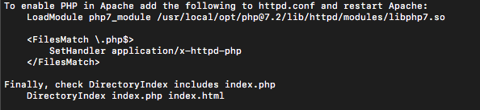

Error seperti ini sering terjadi pada saat kita menjalankan `localhost` dan ketika kita masuk ke folder yang di dalamnya ada file `index.php` atau file php lainnya namun apache tidak membacanya.

Pertama yang harus kita cek adalah apakah module php sudah ada di file `httpd.conf` kita. Untuk mencari dimana letak file `httpd.conf` bisa menggunakan perintah

```
apachectl -V
```

Akan menampilkan informasi mengenai server apache kita, dan file `httpd.conf` berada di `SERVER_CONFIG_FILE` dari informasi tersebut.


Setelah itu cek di dalam file `httpd.conf` apakah ada `php module` di dalamnya, bisa dengan `ctrl+f` / `cmd+f` lalu ketikkan php. Di tempat saya php module nya seperti ini.

`LoadModule php7_module /usr/local/opt/php@7.2/lib/httpd/modules/libphp7.so`

Jika tidak ada, bisa install php dan nanti pada saat proses instalasi akan ada informasi untuk memasukkan module php ke dalam file konfigurasi apache kita.



Masukkan `LoadModule php7_module /usr/local/opt/php@7.2/lib/httpd/modules/libphp7.so` (di tempatmu bisa berbeda) ke dalam file konfigurasi `httpd.conf` tadi. Pastikan letaknya sesuai dengan perintah lainnya agar pada saat mencari modulenya lagi tidak bingung. contohnya


Setelah itu tambahkan `index.php` ke dalam `DirectoryIndex` agar pada saat kita masuk ke sebuah folder yang terdapat file `index.php` file tersebut terbaca oleh Apache. Kemudian tambahkan juga handlernya.

```bash
<FilesMatch \.php$>
  SetHandler application/x-httpd-php
</FilesMatch>
```


Untuk mengatasi php terbaca sebagai teks juga tambahkan `AddType application/x-httpd-php .php` ke dalam file konfigurasi `httpd.conf` apache


Untuk mengetahui dimana dokumen root `www` kita bisa melihat di `httpd.conf` bagian `DocumentRoot`

`DocumentRoot "/usr/local/var/www"`

Sekian semoga bermanfaat.