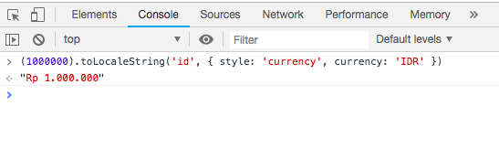

Dalam beberapa kasus kita sering kali melakukan pengubahan format data untuk mengubah integer menjadi format mata uang sebelum ditampilkan di interface. Cara lama saya biasanya menggunakan regex untuk menandai titik dan diberi prepend `Rp` serta di belakangnya menggunakan `.toFixed(2)` untuk memberi koma.

Namun sekarang membuat format currency akan lebih mudah dengan menggunakan method `.toLocaleString()`. Method tersebut akan mengembalikan nilai berupa string dari suatu bilangan dengan representasi dari `language-sensitive` bilangan di suatu negara. Kita bisa memasukkan format angka dari negara manapun. [List local code](https://www.science.co.il/language/Locale-codes.php).

Untuk membuat format rupiah sendiri sangat mudah, kita bisa menggunakan

```js
.toLocaleString('id', { style: 'currency', currency: 'IDR' })
```

maka hasilnya akan seperti berikut.



pranala: [.toLocaleString()](https://developer.mozilla.org/en-US/docs/Web/JavaScript/Reference/Global_Objects/Number/toLocaleString)

Semoga bermanfaat!