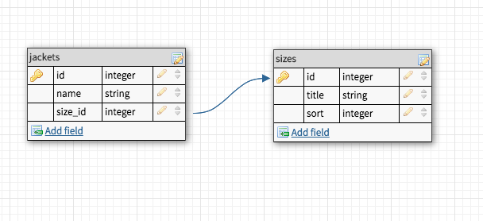
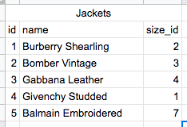
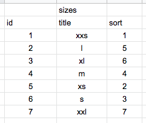
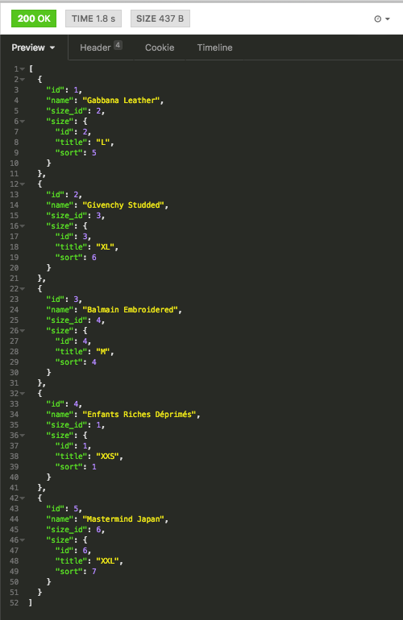
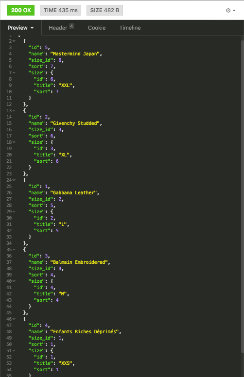

**Misal** kita memiliki data jaket dalam table `jackets` dan ukuran di table `sizes`. Tiap jaket memiliki nama (`name`) dan ukurannya sendiri sehingga memiliki `size_id` sebagai foreign key, dan di dalam table `sizes` terdapat jenis ukuran (`title`) dan urutan ke berapa ukuran tersebut ditampilkan (`sort`).



Sebagai contoh, kita akan memiliki data sebagai berikut.

Jaket



Ukuran / Size



Kita akan mengambil data jaket urut berdasarkan jaket yang memiliki ukuran terbesar. Kali ini saya mencontohkan dengan menggunakan AdonisJS, mungkin setelah ini saya bikin versi Laravel.

Hubungan table `jackets` dengan `sizes` adalah `belongsTo` maka di model `Jacket` akan seperti ini.

```js
class Jacket extends Model {
  size() {
    return this.belongsTo('App/Models/Size')
  }
}
```

Pada saat mengambil data jaket dengan ukuran / size nya tanpa mengurutkan sizenya

```js
const jackets = await JacketModel.query()
  .with('size')
  .fetch()

response.json(jackets)
```

Kita mendapatkan response 



Untuk dapat menggunakan `sort` di dalam table `sizes` di dalam `jackets` kita harus menariknya ke parent table sehingga dapat kita gunakan pada saat `orderBy`.


```js
const jackets = await JacketModel.query()
  .select('jackets.*', Database.raw(`(SELECT sort FROM sizes WHERE jackets.size_id = sizes.id) as sort`))
  .with('size')
  .orderBy('sort', 'DESC')
  .fetch()

response.json(jackets)
```

Maka hasilnya akan urut berdasarkan ukuran jaket dari yang terbesar.



Sekian semoga bermanfaat !