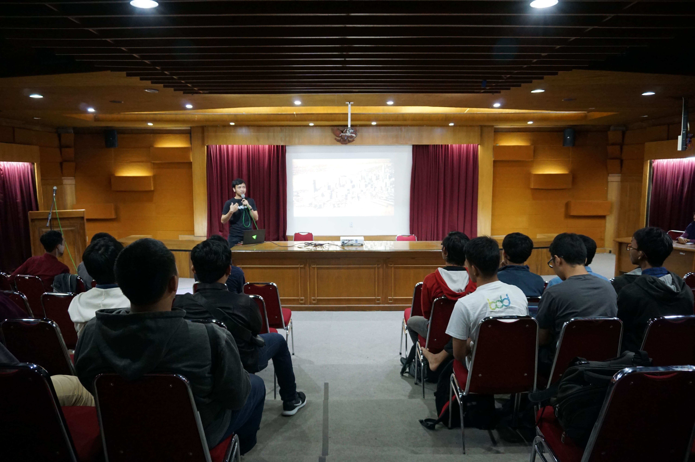
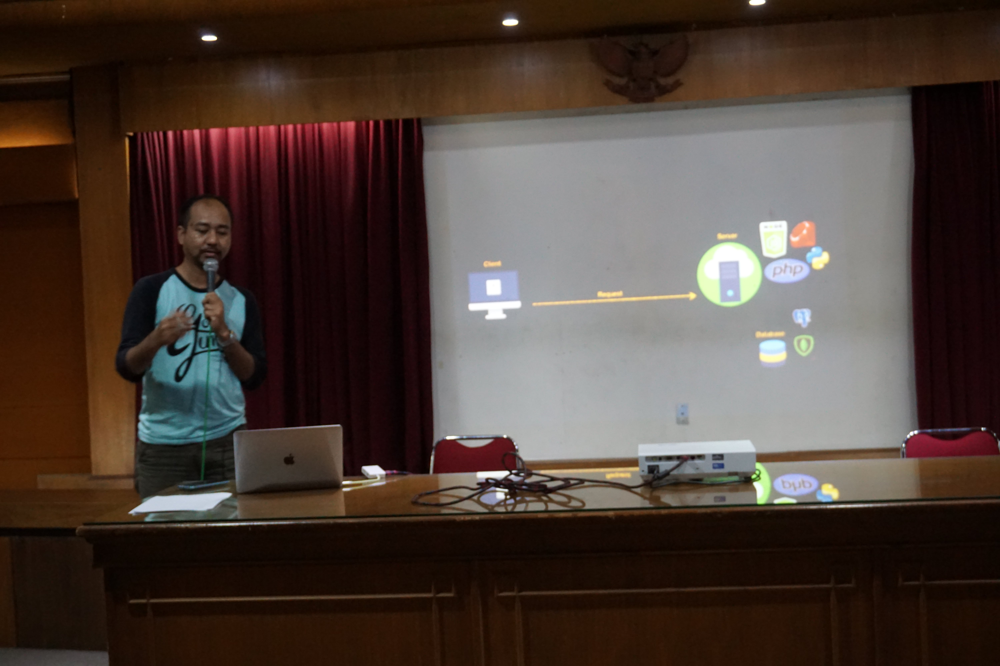
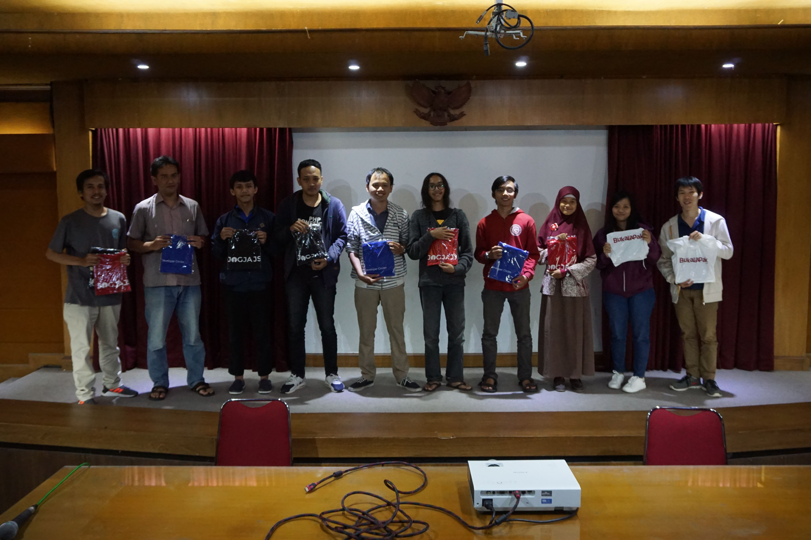
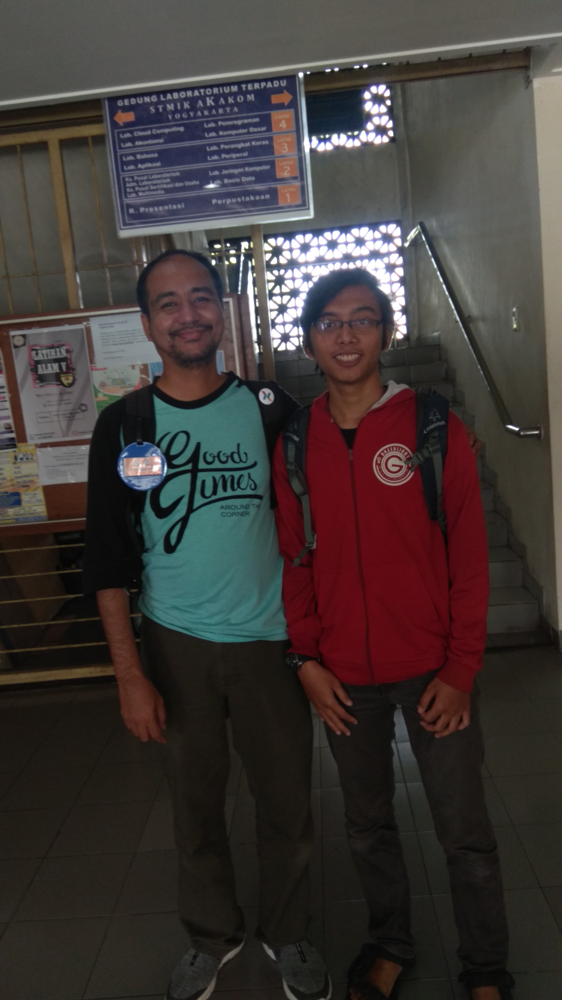

Hari sabtu, 24 November 2018 kemarin Developer Circle Yogyakarta bersama JogjaJS mengadakan tech talk dan workshop di STMIK Akakom Yogyakarta. Acara yang diselenggarakan hampir sehari penuh karena di jadwal tertera acara dimulai pukul 9 dan akan diakhiri pukul 5 sore dan mengusung judul "Skill up to Modern Development". Acara tersebut dibagi menjadi dua bagian, pertama tech talk yang dibawakan Om Riza Fahmi dari Hacktiv8 dan Mas Royyan Bachtiar Frontend Developer di Bukalapak.

Sesi tech talk pertama yang dibawakan Mas Royyan Bachtiar secara garis besar bagaimana penggunaan beberapa API di browser, dimulai dari menceritakan bahwa software development itu bisa diibaratkan dengan pengembangan kota dengan tata letak dan yang lainnya. Bagaimana suatu kota bisa tetap layak dihuni meski populasinya kian bertambah dengan segala macam keruwetannya. Beliau juga menjelaskan bagaimana sebaiknya kita membuat method yang efektif, dengan penggunaan nama method yang sebaiknya menggunakan kata kerja, sifat nilai return yang truthy (misal isDisabled diganti isEnabled), dan urutan parameter disesuaikan dengan prioritas penggunaannya (semakin awal letak parameter semakin sering digunakan).

> The purpose of software engineering is to control complexity, not to create it. - Pamela Zave

Kemudian sesi yang kedua dibawakan oleh Om Riza fahmi tentang static site generator, Gatsbyjs. Beliau memulai topik dengan menceritakan sejarah pembuatan website dengan cms yang perlu membutuhkan / memperlibatkan banyak hal, misalnya hubungan ke backend dan hubungan ke database, dan itu sangat memakan waktu dan resource yang diperlukan. Dengan gatsbyjs kita bisa membuat blog, company profile, dan site yang tidak banyak perubahan dengan lebih cepat. Om Riza menyampaikan materinya sembari praktik dengan gayanya yang membuat para peserta mudah menerima.

Setelah sesi materi tersebut, kemudian sesi tanya jawab. Karena tidak ada yang memulai pertanyaan, saya iseng bertanya tentang "Bagaimana cara deploy gatsby ke hostingan biasa, apakah tinggal ditaruh di public_html?" kepada Om Riza Fahmi, dengan maksud agar nanti mendapatkan giveaway hahaha. Setelah itu karena belum juga ada yang bertanya lagi, pertanyaan kedua saya membuka pertanyaan ke Mas Royyan tentang "di Bukalapak frontendnya menggunakan stack apa?". Dan ya, setelah Mas Royyan menjawab pertanyaan tersebut, mulai ada yang bertanya kemudian, "kenapa vue, kenapa react, apakah bisa framework frontend dibagikan" dsb.

Dari pertanyaan kedua yang saya tanyakan ke Mas Royyan Bachtiar tersebut, saya mempelajari suatu hal dalam teknik bertanya. Tanyakan sesuatu yang bisa membuat pemberi jawaban menjelaskan suatu hal. Disaat saya menanyakan, "Di Bukalapak frontend menggunakan stack apa?" pemberi jawaban akan hanya menjawab, "Kami menggunakan Vue." udah. Namun, jika pertanyaannya dibuat seperti ini, "Di Bukalapak stack frontnend menggunakan apa? Dan apa alasan kenapa dulu memilih stack tersebut?" maka selain si pemberi jawaban akan menjawab stack yang dipakai, juga akan menjelaskan awal mula dulu kenapa memilih stack tersebut, bahkan bisa juga memberi komparasi terhadap stack yang lain. Begitu.

Dan ini foto saya sama Om Riza Fahmi

Jadi begitulah cerita akhir pekan saya kemarin, terima kasih sudah membaca !