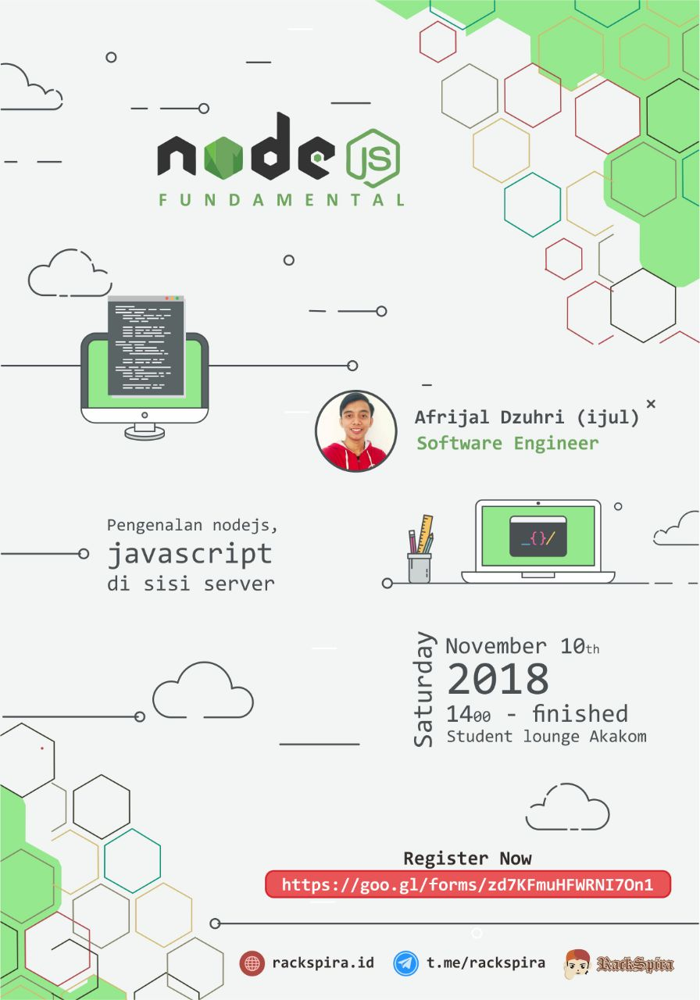

Sekitar dua minggu kemarin saya menjadi pembicara sharing mingguan komunitas Rackspira tentang _Pengenalan NodeJS: Javascript di sisi server_. Awalnya saya masih ragu untuk menjadi pembicara karena harus ngomong di depan banyak orang dan kemampuan berbicara saya saya rasa masih belum begitu baik. Namun karena desakan dari teman saya yang juga ketua dari komunitas tersebut, saya akhirnya mengiyakan seminggu sebelum acara berlangsung.

Dua hari setelah saya mengiyakan ajakkan tersebut, poster saya sudah diupload ke sosial media dan saya merasa excited dengan banyak yang menyemangati dan memberi "mantap mas". Ternyata dukungan teman-teman yang berkecimpung di dunia IT terhadap orang yang mau berbagi itu sangat tinggi, dan sangat diapresiasi, saya sangat kagum.

Hari-hari menjelang acara dimulai saya mempersiapkan materi dan juga berlatih mendeliver suatu penjelasan agar mudah diterima orang lain. Saya merasa saat itu adalah saat yang benar-benar bisa membuat saya belajar memahami suatu hal.

Kata Einstein "if you can't explain it simply you don't understand it well enough" Jika kamu tidak dapat menjelaskan secara sederhana, kamu tidak paham betul.

Jadi saya mulai banyak membaca dengan pelan agar saya memahami maksudnya, juga menonton materi yang akan saya bicarakan di youtube agar mendapat insight dari orang yang pernah membawakan materi tersebut.

Karena waktu yang mepet tersebut saya jadi terpush / terdorong untuk belajar giat untuk paham, bukan sekedar memakainya. Dan karena itu, saya yang dulunya hanya sebatas memakai tanpa mengerti lebih dalam sekarang sudah paham bagaimana sejarah Ryan Dahl membuat NodeJS, bagaimana NodeJS berjalan, dimana NodeJS berjalan, bagaimana javascript bisa berjalan di sisi server dan lain lain.

Dan yang terakhir, meski acara itu hanya sebatas sharing komunitas dan pesertanya tidak banyak saya juga belajar cara berkomunikasi agar lebih baik lagi.

Ingin mendapatkan significant improvement di dalam dirimu? cobalah berbagi :)

Semoga bermanfaat !