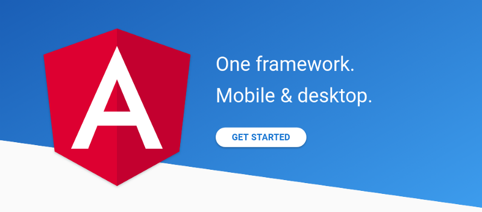

Angular adalah sebuah framework javascript yang memungkinkan kita membuat reaktif Single Page Aplication (SPA). Single Page Aplication yaitu aplikasi yang berjalan hanya pada satu halaman, tidak membutuhkan reload page meskipun nampak di url berpindah halaman.

Terdapat perbedaan versi yang sangat menjurang di angular, yaitu versi Angular 1 atau AngularJS, Angular 2 dan Angular 4 atau Angular (tidak menggunakan JS).

#### AngularJS

versi angular pertama yang juga popular karena menjadi bagian dalam pembuatan web apps.

#### Angular 2

versi angular yang dibuat ulang dari angularJS. Karenanya struktur dan komponen yang terdapat di dalamnya juga berbeda. Di Angular versi ini, kita juga menggunakan <a href="https://www.typescriptlang.org/" target="_blank">Typescript</a> sebagai bahasa pemrogramannya. Typescript yaitu bahasa superset dari javascript yang sudah dicompile.

Di Angular tidak memiliki persamaan dengan Angular 1 / AngularJS jadi jika belajar AngularJS akan sangat berbeda jika ingin belajar ke Angular. Untuk itu jika belum terlanjur belajar AngularJS maka sekalian belajar Angular, Karena pembaruan versi Angular nantinya akan menggunakan versi Angular.

#### Angular 4

Sedangkan Angular 4 kelanjutan dari Angular 2 yang masih dalam satu keluarga. Pembaruan di versi 4 ini dari versi 2 tidak merubah total seperti saat Angular 1 ke Angular 2\. Karena itu untuk Angular 2 dan Angular 4 sering hanya disebut Angular, selain itu pembaruan kedepannya juga menggunakan konsep Angular ini.

Jadi jika ingin belajar Angular, saran saya memulainya dengan versi 2 atau bisa langsung menuju ke webnya, <a href="https://angular.io/" target="_blank">Angular.io</a>.

Sekian dari saya, terima kasih.